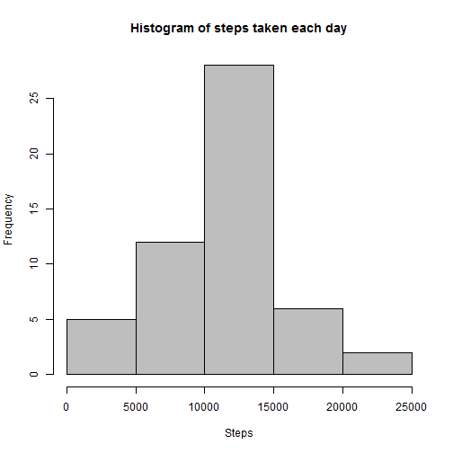
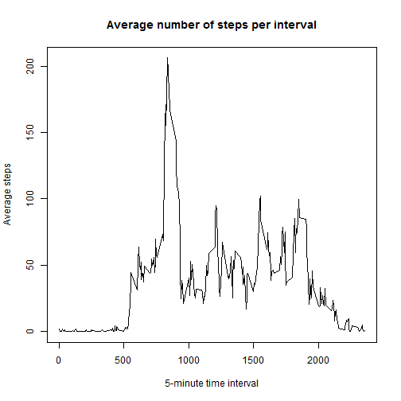
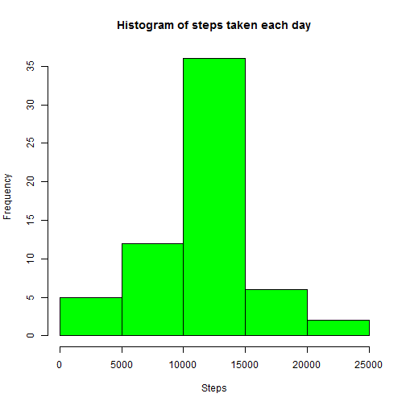
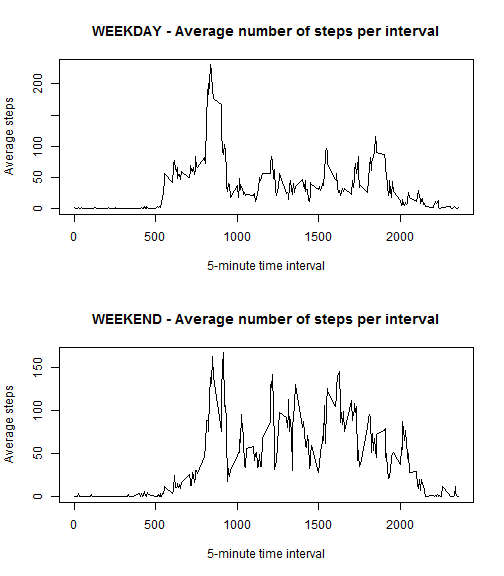

# Reproducible Research - Peer Assigment 1
## Lukasz Bentkowski
This is my html file created in RStudio using R 3.2.1 and **knitr** to fulfill Peer Assigment 1 in Reproducible Research at Coursera.org

Peer Assigment 1 requires to create complete, standalone and single R markdown document that answers all questions and shows R code so that evaluators can review the analysis.

You can find all my work just below. Document is divided into few sections, which are similar to questions asked in Peer Assigment 1. More detailed discription can be found in r code.

# Introduction
This assignment makes use of data from a personal activity monitoring device. This device collects data at 5 minute intervals through out the day. The data consists of two months of data from an anonymous individual collected during the months of October and November, 2012 and include the number of steps taken in 5 minute intervals each day.

# 1. Loading and preprocessing the data

```r
# install and load packages
# install.packages("dplyr")
library("dplyr")
# install.packages("lubridate")
library("lubridate")
#1.a) Loading data for assigment
activity <- read.csv("activity.csv")
#1.b) Transforming data by adding colums of year, month and day.
activity <- activity %>%
  mutate('year' = year(date)) %>%
  mutate('month' = month(date)) %>%
  mutate('day' = day(date))
```

# 2. What is mean total number of steps taken per day?

```r
#2.a) Total number of steps taken per day
steps_per_day <- activity %>%
  group_by(year,month,day) %>%
  summarise(sum(steps))
colnames(steps_per_day) <- c("year","month","day","steps")
#2.b) Histogram of the total steps taken each day.
histogram_steps_each_day <- hist(x = steps_per_day$steps, 
                                 main = "Histogram of steps taken each day",
                                 xlab = "Steps",
                                 col = "gray")
```

 

Mean steps taken per day:

```r
#2.c) Mean for the total number of steps taken per day
mean_steps <- mean(na.omit(steps_per_day$steps))
mean_steps
```

```
## [1] 10766.19
```

Median steps taken per day:

```r
#2.d) Median for the total number of steps taken per day
median_steps <- median(na.omit(steps_per_day$steps))
median_steps
```

```
## [1] 10765
```

# 3. What is the average daily activity pattern?
*NOTE: In this step missing values are ignored as required.

```r
#3.a) Time series plot of mean steps taken per interval.
meansteps_per_interval <- na.omit(activity) %>%
  group_by(interval) %>%
  summarise(mean(steps))
colnames(meansteps_per_interval) <- c("interval","avg_steps")

plot(x = meansteps_per_interval$interval, y = meansteps_per_interval$avg_steps,
    type = "l", main = "Average number of steps per interval",
    xlab = "5-minute time interval", ylab =  "Average steps")
```

 

```r
#3.b) interval with maximum number of steps
maxsteps_interval <- meansteps_per_interval %>%
  filter(avg_steps == max(avg_steps))
maxsteps_interval
```

```
## Source: local data frame [1 x 2]
## 
##   interval avg_steps
## 1      835  206.1698
```

On average 5-minute interval with the highest number of steps is 835 with 206 steps.

# 4. Imputing missing values
*NOTE: In this step missing values are filled with mean steps per interval.

```r
#4.a) number of rows with NAs
print(sum(is.na(activity)))
```

```
## [1] 2304
```

```r
#4.b) new dataset with missing data filled in.
activity_noNA <- activity %>%
  left_join(meansteps_per_interval) %>%
  mutate(steps = ifelse(is.na(steps),avg_steps,steps)) %>%
  select(steps:day)
#4.c) Histogram on dataset with filled/replaced NAs
steps_per_day_filled <- activity_noNA %>%
  group_by(year,month,day) %>%
  summarise(sum(steps))
colnames(steps_per_day_filled) <- c("year","month","day","steps")

histogram_steps_each_day_filled <- hist(x = steps_per_day_filled$steps, 
                                 main = "Histogram of steps taken each day",
                                 xlab = "Steps",
                                 col = "green")
```

 

Mean steps taken per day with missing data filled in:

```r
#4.d) Mean for the total number of steps taken per day
mean_steps_filled <- mean(steps_per_day_filled$steps)
mean_steps_filled
```

```
## [1] 10766.19
```

Median steps taken per day with missing data filled in:

```r
#4.e) Median for the total number of steps taken per day
median_steps_filled <- median(steps_per_day_filled$steps)
median_steps_filled
```

```
## [1] 10766.19
```

My approach of filling in missing data with *mean number of steps per interval* caused that the *total mean number of steps taken per day* is exactly the same as in first part of assigment while median is a bit higher. Histogram differs a bit as the frequencies of observations are higher but the distribution is almost the same.

# 5. Are there differences in activity patterns between weekdays and weekends?

```r
#5.a) create new factor variable with weekday and weekend
activity_noNA <- activity_noNA %>%
  mutate('weekday' = wday(as.Date(activity_noNA$date))) %>%
  mutate('dayofweek' = as.factor(ifelse(weekday == 7 | weekday == 1 ,"weekend","weekday")))

#5.b) dataset of mean steps per interval on weekday
meansteps_per_interval_weekday <- (activity_noNA) %>%
  filter(dayofweek == 'weekday') %>%
  group_by(interval) %>%
  summarise(mean(steps))
colnames(meansteps_per_interval_weekday) <- c("interval","avg_steps_weekday")

#5.b) dataset of mean steps per interval on weekend
meansteps_per_interval_weekend <- (activity_noNA) %>%
  filter(dayofweek == 'weekend') %>%
  group_by(interval) %>%
  summarise(mean(steps))
colnames(meansteps_per_interval_weekend) <- c("interval","avg_steps_weekend")

#5.c) panel plot with two time series plot of steps taken on weekday and weekend
par(mfrow=c(2,1))
plot(x = meansteps_per_interval_weekday$interval,
     y = meansteps_per_interval_weekday$avg_steps_weekday,
     type = "l", main = "WEEKDAY - Average number of steps per interval",
     xlab = "5-minute time interval", ylab =  "Average steps")
plot(x = meansteps_per_interval_weekend$interval,
     y = meansteps_per_interval_weekend$avg_steps_weekend,
     type = "l", main = "WEEKEND - Average number of steps per interval",
     xlab = "5-minute time interval", ylab =  "Average steps")
```

 

There is a clear difference in activity patterns during weekdays and weekends.
